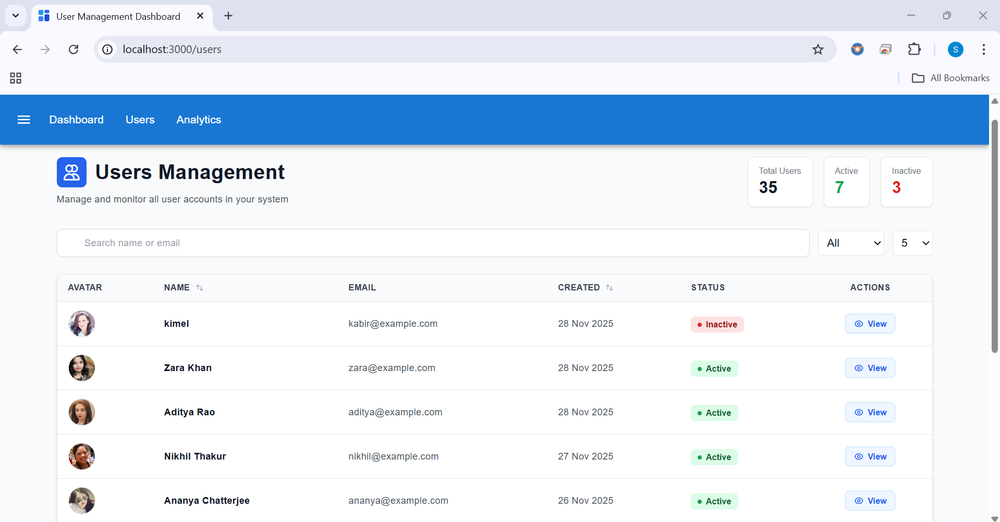
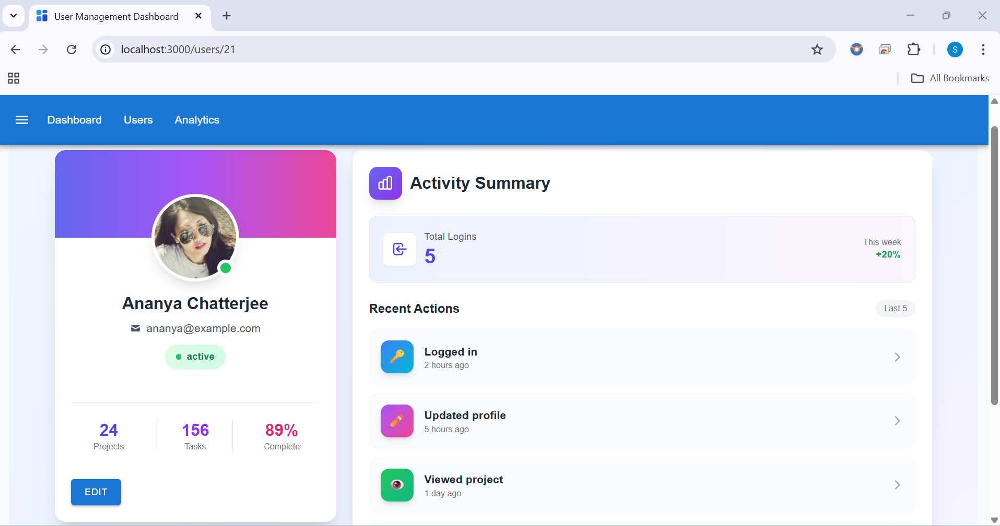
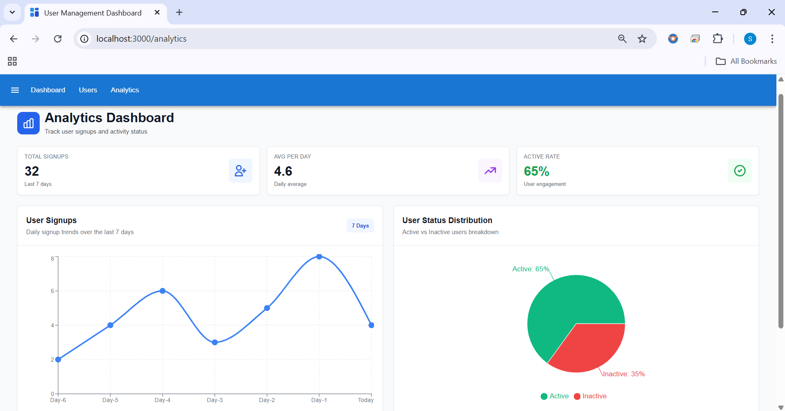

📘 User Management Dashboard

A modern, responsive User Management + Analytics Dashboard built using React, TypeScript, TailwindCSS, Redux Toolkit, MUI, and React Query.
Includes features like user listing, filtering, sorting, profile details, Pagination and edit modal.

🚀 Features

👥 Users List with pagination, search, filters & sorting

📄 User Details Page with activity summary

✏️ Edit User Modal (name + status)

🌙 Dark Mode with localStorage persistence

📊 Analytics Page (Signup Trend + Status Pie Chart)

⚡ React Query for caching & async state

🎨 MUI + TailwindCSS for clean UI

🗄️ JSON Server mock backend

🧱 Scalable folder architecture

📦 How to Run the Project

1️⃣ Clone the repository
    git clone https://github.com/YOUR_USERNAME/user-management-dashboard.git
    cd user-management-dashboard

2️⃣ Install dependencies
    npm install

3️⃣ Start JSON Server (Mock API)
   npm run json-server

JSON Server runs at:
👉 http://localhost:5000/users

4️⃣ Start the React App
    npm run dev

Frontend runs at:
👉 http://localhost:5173

📚 Libraries Used
    React 18

    TypeScript

    React Router DOM

    TailwindCSS

    MUI (Material UI)

    State Management

    Redux Toolkit (global filters, theme state)

    React Query (server state caching)

Charts

   Recharts

Mock API

    JSON Server

    Utilities

    clsx

    date-fns

🏗️ Architecture Overview

The project is structured using a clean and scalable modular architecture:

src/
 ├── api/          → API calls (axios/json-server)
 ├── components/   → Reusable UI components
 ├── pages/        → Route-level pages (Users, Details, Analytics)
 ├── store/        → Redux Toolkit slices
 ├── hooks/        → Custom reusable hooks
 ├── types/        → TypeScript interfaces
 ├── utils/        → Helpers (debounce, formatters)
 └── styles/       → Global styles (if any)

Why this architecture?

✔ Easy to scale
✔ Clear separation of UI state & server state
✔ Clean boundaries between pages, components, and API calls
✔ Reusable presentational components
✔ Faster development using Tailwind utility classes

📸 Screenshots

Users List

User Details

Analytics Dashboard

